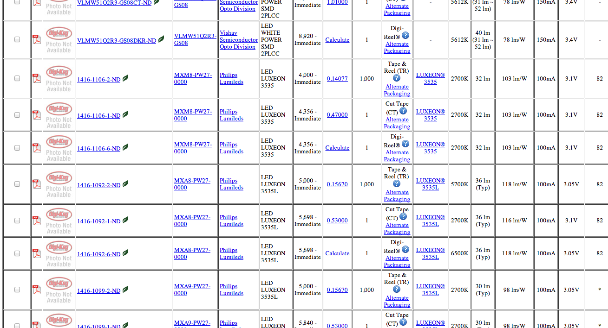
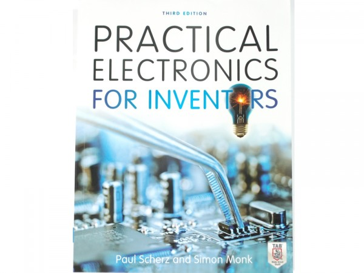

# Completing the Circuit
From Arduino to General Embedded Hardware

by Scott Vokes

<!---
So, this talk is about how to get your feet wet with general embedded hardware,
if you only have a bit of experience with Arduino.
--->

# Hi.

+ I work for Atomic Object
+ I'm @silentbicycle on twitter & github

<!---
atomicobject.com
twitter.com/silentbicycle/
github.com/silentbicycle/
--->

# What's great about Arduino

<!---
+ lots of approachable intros for beginners!
+ designed so artists, designers, hobbyists, etc. can do cool stuff
+ not terribly expensive to get started, $25ish
+ consistent hardware package
+ lots of issues are handled upfront (USB ISP, power regulation, ...)
+ there is a path from Arduino prototypes to production devices

--->

# Where using only Arduino can hold you back

<!---
+ not everything useful is available as a shield
+ shields are often expensive
+ order of magnitude more expensive than bare microcontrollers
+ the Arduino environment, vs. what's available for normal C
--->

# Okay, so how do we get off of "prototyping" hardware

# What's in an Arduino?

<!---
+ Two ATmega328P chips
+ Voltage regulator, to clamp power to 5V DC
+ Attachments for USB and barrel-jack DC power
+ a standard PCB with conveniently labeled headers/pins
+ Capacitors, LEDs, etc.
--->

# Bare minimum (per project)

<!---
+ An ATtiny, I like the ATtiny84
+ breadboard or perfboard
+ A voltage regulator, e.g. LM7805 (5V)
+ Capacitors, LEDs & resistors, etc.
--->

# How much does that cost?

# Typically $2-3.

# ...oh.

<!---
Yeah, a lot of the commonly used hardware is quite cheap.
--->

# Buying parts

# Sparkfun?

<!---
Sparkfun is nice. They have a decent selection of stuff, and the comment
threads are often quite helpful. Still, you're trading the convenience
of them selecting hardware for some markup, and if they don't carry
something, you're out of luck. It's good to have other options as well.
--->

# Digi-Key, Mouser, etc.

<!---
Now we're getting to big distributors -- hobbyists are only a small
part of their business. They have massive selections, and usually far
better prices because of economy of scale, but they take some
getting used to.
--->

# Digi-Key can be intimidating as heck

<!---
So, you want some white LEDs. You go to Digi-Key, and type in
"white LED". Hey, so, which of these 12,592 different types
were you're looking for?
--->

# "Records matching criteria: twenty-nine bazillion"

<!---
You need to know more about your needs to weed the options
down further. How will the part be connected to your project?
How many do you want? (3, or a reel of 3,000?) Are you willing
to pay more for one that operates at -30*F?
--->

#

# What Does Any of This Even Mean, OMG

<!---
Choosing an option or two can help weed things down significantly.
There are usually a couple parts that are the main ones in stock,
while others are 'available', and if you need something you can use
with a breadboard, etc., that can limit things further.
--->

# Getting parts you can work with

# DIP: pins

<!---
Some parts are DIP ("dual in-line package"). These usually work with
breadboards (though some have unusual spacing between pins). Other
components are also called "through-hole" parts, because resistors,
capacitors, etc. have wires that go through a perfboard or into a
breadboard, rather than soldering flush with a board.
--->

# SOIC: surface-mount (maybe)

<!---
With some practice, you can also use surface-mount components.

"SMT Soldering: It's Easier Than You Think":
    http://www.siliconfarmers.com/smtmanga/
--->

# Things you'll need

<!---
Since you're no longer using an Arduino as an all-in-one package,
you will need some additional tools.
--->

# An ISP (In-System Programmer)

<!---
The most significant one is an ISP, which is used to flash compiled
code into ROM of microcontrollers, like a firmware upgrade.
--->

# USBtinyISP from adafruit.com

<!---
I have one of these. It works pretty well. It can power the micro
while connected, which is convenient.
--->

# Using an Arduino as an ISP: ArduinoISP sketch

<!---
You can also use an Arduino as an ISP. There is a sketch included
with the Arduino platform, called "ArduinoISP". In the comments,
it lists which pins you need to connect to your micro in order
to flash it. Which pins you connect to on your micro depends;
more on that in a minute.
--->

# (You're buying a whole ISP with every Arduino, $$$)

# Data sheets

<blink>LEARN TO READ THEM.</blink>

<!---
Data sheets are where you can read about the gory details for
a particular micro. While you probably won't have much use for
some of the information for a while, if ever (such as thermal
info for reflow soldering), they also have important info like
pinouts, min/max power tables, timing info, example circuits,
and details about registers that control important functionality.
--->

# Pinout

<!---
Here's an example pin diagram, for an ATtiny84 (a nice small,
cheap AVR microcontroller). If you look closely, you can see
the power pin (VCC), the ground pin (GND), other pins used for
programming (RESET, MISO, MOSI, SCL), pins for an external
crystal/oscillator (XTAL1 & 2), and which pin is which when
used for analog IO or GPIO.

You'll get used to the abbreviations eventually.
--->

# AVR-GCC & AVR-libc

C compiler and runtime libraries for AVR microcontrollers
<!---
http://www.nongnu.org/avr-libc/
http://www.nongnu.org/avr-libc/
--->

# AVRDUDE

Command-line tool for flashing AVR micros

<!---
http://www.nongnu.org/avrdude/

(Also, there's simulavr and AVaRICE, though I don't have
time for them here.)
--->

# Embedded-friendly testing tools

http://github.com/silentbicycle/greatest

<!---
Due disclosure: I wrote greatest, so I'm a bit biased. :)
--->

# A good reference book

# Questions?  @silentbicycle
